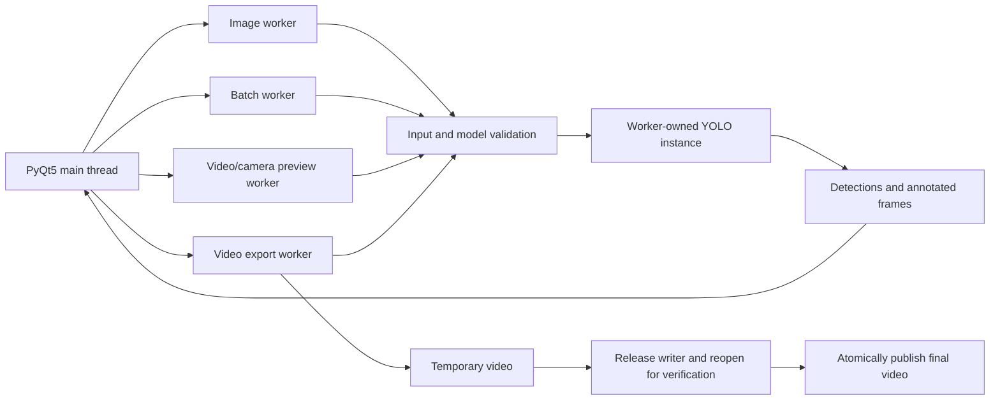

# Detection-System: Grape Maturity Detection

[中文文档](README.md)

Detection-System is a Windows desktop application for detecting grapes and classifying each detection as `immature`, `semi-mature`, or `mature`. It combines an Ultralytics YOLO model with a PyQt5 interface and accepts individual images, image folders, video files, and live camera input.

The project goes beyond a minimal inference demo. It addresses model trust, thread ownership, corrupt media, accidental output replacement, cancelable video export, spreadsheet-formula injection, and unbounded result-table growth. It is suitable for coursework, computer-vision prototypes, agricultural imaging demonstrations, and assistive workflows that include independent validation and human review.

> This is not a food-safety, harvesting, certification, or procurement system. The training dataset for the bundled checkpoint is not included, and model output must not be the sole basis for a high-impact decision.

## Quick navigation

- [Feature overview](#feature-overview)
- [Quick start](#quick-start)
- [Desktop application guide](#desktop-application-guide)
- [Command-line tools](#command-line-tools)
- [Configuration](#configuration)
- [Replacing the model](#replacing-the-model)
- [Architecture and thread model](#architecture-and-thread-model)
- [Development and verification](#development-and-verification)
- [Building the Windows executable](#building-the-windows-executable)
- [Troubleshooting](#troubleshooting)
- [Known limitations](#known-limitations)
- [License and compliance status](#license-and-compliance-status)

## Feature overview

| Capability | Current behavior |
| --- | --- |
| Single image | Detection, class/confidence/coordinate details, debounced re-detection after option changes, annotated image and CSV export |
| Image folder | Non-recursive batch processing, per-file failure isolation, result caching, annotated-image export, consolidated CSV export |
| Video file | Frame-by-frame background preview, live option updates, cancelable full-video export |
| Camera | Configurable device index, background live preview, safe stop on a second click |
| Model protection | SHA-256 verification before loading, followed by exact class-ID and class-name validation |
| Media protection | Extension, file-size, image-dimension, decode, video-metadata, and duration checks |
| Output protection | User-data output directory, collision-safe filenames, verified temporary video followed by atomic publication |
| Runtime stability | One YOLO instance per worker, partial-file cleanup on cancellation, and a 500-row table limit |
| Engineering quality | 18 automated tests, Ruff, pip-audit, Dependabot, Windows CI, and a Windows release workflow |

## Detection classes

The bundled model uses the following fixed mapping. A replacement model must preserve these IDs and meanings; otherwise, the application rejects it.

| Class ID | Model name | UI label |
| ---: | --- | --- |
| 0 | `immature` | 未成熟 / Immature |
| 1 | `semi-mature` | 半成熟 / Semi-mature |
| 2 | `mature` | 成熟 / Mature |

## System requirements

### Continuously tested targets

- Operating system: Windows 10/11
- Python: CPython 3.10 and 3.12 in GitHub Actions
- Inference: CPU works without dedicated graphics hardware; NVIDIA GPU acceleration requires a compatible PyTorch/CUDA installation
- Desktop UI: PyQt5
- Model runtime: PyTorch, TorchVision, and Ultralytics
- Media handling: OpenCV and Pillow

Runtime packages are pinned in `requirements.txt`. Python 3.10/3.11 resolves NumPy 2.2.6, while Python 3.12 resolves NumPy 2.5.2.

For GPU inference, use the official [PyTorch Start Locally](https://pytorch.org/get-started/locally/) selector and choose a combination that matches your operating system, Python version, GPU driver, and CUDA platform. This repository pins the PyTorch/TorchVision versions it tests. If you replace that runtime, rerun the full test suite and model smoke test.

## Quick start

The following commands use PowerShell.

```powershell
git clone https://github.com/liuxiao20051106-prog/Detection-System.git
cd Detection-System

python -m venv .venv
.venv\Scripts\Activate.ps1

python -m pip install --upgrade pip
python -m pip install -r requirements.txt

python MainProgram.py
```

Alternatively:

```powershell
python installPackages.py
```

That helper installs `requirements.txt` with the current Python interpreter. A virtual environment is still recommended so the project's pinned packages do not modify the system Python installation.

### What happens at startup

Before presenting the main window, the application:

1. creates or validates the result directory;
2. confirms that the configured model file exists;
3. computes its SHA-256 and compares it with the configured value;
4. verifies the hash and class mapping again when a worker loads the model.

If the path is invalid, the file has changed, the hash does not match, or the class order is incompatible, startup or inference stops with an error. The application does not silently accept an unknown model.

## Desktop application guide

### 1. Single-image detection

1. Select the image mode and choose an image.
2. Wait while a background worker loads the model and runs inference.
3. Review the annotated image in the center panel.
4. Review class, confidence, and bounding-box coordinates in the result table.
5. Select a detection to view its detailed fields.
6. Select save to export both the annotated image and a CSV file.

Supported image extensions: `.jpg`, `.jpeg`, `.png`, and `.bmp`.

Changing confidence, IoU, or label visibility in image mode schedules a short debounced re-detection. This prevents a burst of inference jobs while the user is continuously adjusting a control.

### 2. Folder-based batch detection

1. Select the folder mode and choose a directory.
2. The application reads supported images from that directory only; it does not recurse into child directories.
3. Each image is validated and detected independently.
4. A corrupt file is reported and skipped without aborting the remaining batch.
5. Select save to copy the cached annotated images and create a consolidated CSV.

Saving a batch does not run inference again. The exported images therefore match the completed batch, and the save operation avoids duplicate compute.

### 3. Video preview and export

1. Select the video mode and choose a file.
2. A background worker validates and detects frames while the UI remains responsive.
3. Confidence, IoU, and label visibility can be changed during preview; subsequent frames use the new values.
4. Selecting save displays a warning that exported video does not retain source audio.
5. After confirmation, preview stops and the complete source video is processed again from the beginning.
6. The export progress dialog can cancel the operation.

Supported video extensions: `.avi`, `.mp4`, `.wmv`, `.mkv`, `.mov`, and `.m4v`.

Exports use XVID video in an AVI container. Frames are first written to a hidden `.partial.avi` file. The writer is released, the temporary video is reopened to verify frame metadata and dimensions, and only then is it atomically moved to the final path. Cancellation, inference failure, encoding failure, or verification failure removes the partial file.

### 4. Camera preview

1. Select the camera mode to open the device configured by `DETECTION_CAMERA_ID`.
2. Select the same control again to stop the preview safely.
3. If the worker cannot stop within the wait period, the UI preserves the running state and asks the user to retry later.

Camera mode currently provides live preview only. It does not record or directly save a video. To retain camera footage, capture it with a trusted recorder and process the resulting file through video mode.

## Detection controls

| Control | Purpose | Trade-off |
| --- | --- | --- |
| Confidence threshold | Filters low-confidence detections | Raising it can reduce false positives but increase missed detections; lowering it does the reverse |
| IoU threshold | Controls how overlapping detections are suppressed | Lower values merge overlapping boxes more aggressively; higher values can retain more nearby boxes |
| Show labels | Draws class and confidence text on annotated output | Changes rendering only; it does not change the underlying detections |

Lighting, grape variety, occlusion, distance, optics, and camera hardware can all change the useful threshold range. No single parameter set should be treated as universally optimal.

## Output files

### Default location

On Windows, output is written to:

```text
%LOCALAPPDATA%\Detection-System\results
```

Override it with `DETECTION_SAVE_PATH`. Runtime results are not written into the repository or application installation directory.

### Naming behavior

| Input mode | Typical output |
| --- | --- |
| Single image | `grape_detect_result.png` and `grape_detections.csv` |
| Image batch | One `*_detect_result.<extension>` per successful image and `<folder>_detect_results.csv` |
| Video | `<source>_detect_result.avi` |

If a destination already exists, the application adds `_2`, `_3`, and subsequent suffixes rather than overwriting the prior result.

CSV files use UTF-8 with a byte-order mark for reliable Chinese text handling in common Windows spreadsheet applications. Text fields are neutralized if a spreadsheet-formula prefix (`=`, `+`, `-`, or `@`) appears at the beginning or after leading whitespace.

## Command-line tools

The repository includes four standalone entry points in addition to the GUI.

### Detect one image

```powershell
python imgTest.py "D:\images\grape.jpg"
python imgTest.py "D:\images\grape.jpg" --output "D:\results" --conf 0.35 --iou 0.50
```

| Argument | Required | Default | Description |
| --- | --- | --- | --- |
| `image` | Yes | — | Input image path |
| `--output` | No | Configured result directory | Annotated-image output directory |
| `--conf` | No | `0.25` | Confidence threshold |
| `--iou` | No | `0.45` | IoU threshold |

### Preview a video

```powershell
python VideoTest.py "D:\videos\grape.mp4"
```

Press `q` to stop. This command is an interactive preview and does not write an output video.

### Preview a camera

```powershell
python CameraTest.py --camera 0
```

Press `q` to stop. The default device index comes from `DETECTION_CAMERA_ID`.

### Train a model

```powershell
python train.py --data "D:\dataset\data.yaml"
python train.py --data "D:\dataset\data.yaml" --model yolov8n.pt --epochs 120 --batch 16 --seed 0
```

| Argument | Required | Default | Description |
| --- | --- | --- | --- |
| `--data` | Yes | — | Existing YOLO dataset YAML file with a `.yaml` or `.yml` extension |
| `--model` | No | `yolov8n.pt` | Pretrained model name or local weight path |
| `--epochs` | No | `100` | Training epochs |
| `--batch` | No | `4` | Batch size |
| `--seed` | No | `0` | Random seed |

The training entry point requests deterministic behavior, but full reproducibility still depends on the dataset, drivers, hardware, dependency versions, and low-level operators. The dataset used for the bundled checkpoint is not included.

## Configuration

Runtime defaults live in `Config.py`. The following environment variables override them:

| Environment variable | Default | Description |
| --- | --- | --- |
| `DETECTION_MODEL_PATH` | `models/best.pt` | Absolute or relative inference-model path |
| `DETECTION_MODEL_SHA256` | Bundled hash | Expected 64-character hexadecimal SHA-256 |
| `DETECTION_SAVE_PATH` | `%LOCALAPPDATA%\Detection-System\results` | Image, CSV, and video output directory |
| `DETECTION_CAMERA_ID` | `0` | OpenCV camera device index |

PowerShell example:

```powershell
$env:DETECTION_MODEL_PATH = "D:\models\best.pt"
$env:DETECTION_MODEL_SHA256 = "<64-character SHA-256>"
$env:DETECTION_SAVE_PATH = "D:\detection-results"
$env:DETECTION_CAMERA_ID = "1"

python MainProgram.py
```

These assignments affect the current PowerShell process and its child processes unless you persist them in user or system environment settings.

## Replacing the model

A PyTorch `.pt` checkpoint is not ordinary inert data; serialized objects may execute code during loading. Use only models whose provenance, authorization, and contents you trust.

Recommended replacement process:

1. Store trusted weights in a controlled external directory, or replace `models/best.pt` only after confirming redistribution rights.
2. Compute SHA-256:

   ```powershell
   Get-FileHash -Algorithm SHA256 "D:\models\best.pt"
   ```

3. Set both `DETECTION_MODEL_PATH` and `DETECTION_MODEL_SHA256`.
4. Confirm that the exact mapping is `{0: immature, 1: semi-mature, 2: mature}`.
5. Run the source smoke test and the full automated test suite.
6. If the repository default changes, update `Config.py`, `MODEL_CARD.md`, tests, and provenance/license records together.

Source smoke test:

```powershell
python MainProgram.py --self-test
Get-Content "$env:TEMP\Detection-System-self-test.log"
```

The smoke test verifies model identity and classes, then performs real inference on a blank image. A successful run writes `OK`.

## Input and security boundaries

### Image limits

- Maximum file size: 100 MiB
- Maximum pixels: 80,000,000
- Pillow reads dimensions before OpenCV performs a complete decode
- Files with a supported extension but corrupt content are rejected

### Video limits

- Maximum file size: 20 GiB
- Maximum pixels per frame: 80,000,000
- Maximum duration: four hours when usable frame-count metadata is available
- Invalid frame rates fall back to 25 FPS for preview/export timing

These checks reduce accidental resource exhaustion and common corrupt-file failures. They do not make third-party codecs a completely trusted boundary. When processing untrusted media, use a restricted operating-system account, an isolated environment, and current security updates.

See [SECURITY.md](SECURITY.md) for private reporting guidance and the complete trust-boundary description.

## Architecture and thread model



The architecture follows these rules:

- the Qt main thread handles UI events and presentation, not YOLO inference;
- each task creates and owns its model inside its worker thread;
- models are never shared across concurrent workers;
- stop operations use cooperative events instead of forcefully terminating a thread;
- window close requests stop and waits for workers to confirm termination;
- every worker rechecks model identity and classes before loading;
- batch detection caches annotated output so save does not repeat inference;
- video success is emitted only after writer release and reopen verification.

This design accepts additional model-loading latency and short-lived memory use in exchange for explicit ownership and verifiable cancellation. See [ADR-0001](docs/decisions/0001-background-workers-and-trusted-models.md) for the decision record and the Ultralytics [Thread-Safe Inference guide](https://docs.ultralytics.com/guides/yolo-thread-safe-inference/) for upstream context.

## Repository layout

```text
Detection-System/
├─ MainProgram.py                 GUI state, interactions, and task orchestration
├─ Config.py                      Model, hash, output, camera, and class configuration
├─ detection_core.py              Input validation, result types, and safe exports
├─ workers.py                     Image, batch, preview, and export worker threads
├─ detect_tools.py                OpenCV/Pillow/Qt image helpers
├─ imgTest.py                     Single-image CLI
├─ VideoTest.py                   Video-preview CLI
├─ CameraTest.py                  Camera-preview CLI
├─ train.py                       Configurable YOLO training entry point
├─ DetectionSystem.spec           Windows PyInstaller specification
├─ hooks/                         Torch/PyQt packaging hooks
├─ UIProgram/                     Qt-generated UI, style, and embedded resources
├─ models/
│  ├─ best.pt                     Bundled inference checkpoint
│  └─ imported_train_result_*/    Retained training metrics and plots
├─ TestFiles/                     Manual demonstration images, not a benchmark
├─ tests/                         Core, worker, GUI, and export regression tests
├─ docs/decisions/                Architecture decision records
├─ .github/workflows/             CI and Windows release workflows
├─ requirements.txt               Pinned runtime dependencies
├─ requirements-dev.txt           Test, lint, and audit dependencies
└─ requirements-build.txt         Windows packaging dependencies
```

## Bundled model

Default checkpoint: `models/best.pt`

```text
SHA-256: ada66cb1215507aa4652d60b073ef64f9c6465daeac7e96475abe151b3d120c0
```

The retained training log reports epoch 85 as the best validation epoch:

| Metric | Value |
| --- | ---: |
| Precision | 0.64801 |
| Recall | 0.59576 |
| mAP@0.5 | 0.61437 |
| mAP@0.5:0.95 | 0.45016 |

These values describe the retained training log, not guaranteed performance in every deployment. The repository does not contain the training data, annotation rules, data licenses, or split definition, so the metrics cannot be independently reproduced or audited from this repository alone. See [MODEL_CARD.md](MODEL_CARD.md) for detailed limitations.

## Development and verification

Install development dependencies:

```powershell
python -m venv .venv
.venv\Scripts\Activate.ps1
python -m pip install --upgrade pip
python -m pip install -r requirements-dev.txt
```

Run the required checks:

```powershell
$env:QT_QPA_PLATFORM = "offscreen"
$env:PYTHONDONTWRITEBYTECODE = "1"

python -m ruff check .
python -m unittest discover -s tests -v
python -m pip_audit -r requirements.txt --strict
```

Current regression coverage includes:

- configuration, class mapping, and required resource presence;
- Unicode-path image read/write behavior;
- corrupt images, video metadata, and model-hash validation;
- output collision handling and CSV formula neutralization;
- embedded Qt resources, resizable layout, table cap, and single-emission cancellation;
- camera-state preservation when a worker cannot stop;
- partial-video deletion after cancellation;
- video completion only after the file can be reopened.

GitHub Actions runs Ruff and all tests on Windows with Python 3.10 and 3.12. The Python 3.12 job also performs the complete dependency vulnerability audit.

## Building the Windows executable

```powershell
python -m pip install -r requirements-build.txt
python -m PyInstaller --noconfirm --clean DetectionSystem.spec
```

Output:

```text
dist\Detection-System.exe
```

After packaging, run the executable smoke test:

```powershell
$process = Start-Process `
  -FilePath "dist\Detection-System.exe" `
  -ArgumentList "--self-test" `
  -WindowStyle Hidden `
  -Wait `
  -PassThru

$process.ExitCode
Get-Content "$env:TEMP\Detection-System-self-test.log"
```

The build is accepted only if the exit code is `0` and the log contains `OK`. A successful PyInstaller build message alone does not prove that Torch, Qt, the checkpoint, and inference load correctly inside the packaged executable. See the [PyInstaller manual](https://pyinstaller.org/en/stable/) for packaging concepts.

The release workflow can be triggered in two ways:

- manually run `Build Windows release` in GitHub Actions;
- push a `v*` tag to test, build, smoke-test, upload the executable, and create a GitHub Release.

## Troubleshooting

### Model integrity verification fails

The model content does not match `DETECTION_MODEL_SHA256`. Do not disable the check. Confirm provenance, recompute the digest, and update both path and hash intentionally.

### Model classes do not match configuration

The model `names` mapping differs from the three-class contract or uses another order. Use a compatible model, or explicitly update configuration, UI semantics, model documentation, and tests as one product change.

### Camera cannot be opened

- ensure another application is not holding the camera;
- review Windows camera privacy permissions;
- try device index `1` or another value;
- isolate the issue with `python CameraTest.py --camera <index>`.

### Video cannot be opened or exported

The OpenCV wheel may not support the source codec. Transcoding the source to a common MP4/H.264 file can help with input compatibility; the application still exports XVID/AVI. Confirm that the output directory is writable and enough disk space is available.

### The UI works but no boxes appear

- lower the confidence threshold;
- confirm the objects belong to the three trained classes;
- check focus, lighting, scale, and occlusion;
- build an independently labeled evaluation set before using data outside the training distribution.

### PowerShell blocks virtual-environment activation

Temporarily allow scripts in the current shell:

```powershell
Set-ExecutionPolicy -Scope Process -ExecutionPolicy Bypass
.venv\Scripts\Activate.ps1
```

You can also skip activation and call `.venv\Scripts\python.exe` directly.

### NVIDIA GPU is not used

Check the installed runtime:

```powershell
python -c "import torch; print(torch.__version__); print(torch.cuda.is_available())"
```

If the result is `False`, verify the driver and the CUDA build recommended by the PyTorch installation selector. Do not mix incompatible Torch and TorchVision builds.

## Known limitations

- Continuous testing targets Windows and the Python versions pinned by this project.
- Camera mode does not directly record or export video.
- Exported video does not retain source audio.
- Batch image mode does not recurse into subdirectories.
- The UI retains at most the most recent 500 result rows.
- Each task loads its own model, which adds startup latency and temporary memory use.
- Training data, annotations, provenance, and data-license files for the bundled checkpoint are absent.
- Included images are demonstrations, not a labeled benchmark.
- Reported metrics do not establish generalization across varieties, regions, seasons, devices, occlusion, and lighting.
- The repository has no owner-declared project-level license.

## Documentation index

- [MODEL_CARD.md](MODEL_CARD.md): metrics, intended use, and data limitations
- [SECURITY.md](SECURITY.md): private reporting and model/media trust boundaries
- [THIRD_PARTY_NOTICES.md](THIRD_PARTY_NOTICES.md): third-party licensing considerations
- [CONTRIBUTING.md](CONTRIBUTING.md): development, testing, and submission rules
- [CHANGELOG.md](CHANGELOG.md): project change history
- [ADR-0001](docs/decisions/0001-background-workers-and-trusted-models.md): background-worker and trusted-model decision
- [Ultralytics Quickstart](https://docs.ultralytics.com/quickstart/): official Ultralytics installation and usage documentation

## Contributing

When submitting a feature or fix:

1. preserve the PyQt5 desktop application and three maturity classes;
2. do not run inference on the Qt main thread or share a YOLO instance between workers;
3. do not bypass model identity, class mapping, or media validation;
4. add regression coverage for behavior changes;
5. run Ruff, the complete test suite, and applicable dependency audits;
6. do not commit outputs, IDE state, caches, unauthorized datasets, or untrusted weights;
7. update the digest, model card, tests, and provenance records when changing the default model.

See [CONTRIBUTING.md](CONTRIBUTING.md) for the complete checklist.

## License and compliance status

This repository currently has no owner-declared `LICENSE` file. Until the owner selects one, do not assume that the project code, model, or media can be copied, modified, redistributed, or used commercially.

PyQt5, Ultralytics, OpenCV, video codecs, model weights, and training data have separate terms. Before distributing an executable, operating a hosted service, or using the project commercially, review every applicable license and the provenance of model/data assets. [THIRD_PARTY_NOTICES.md](THIRD_PARTY_NOTICES.md) describes known boundaries but is not legal advice.
