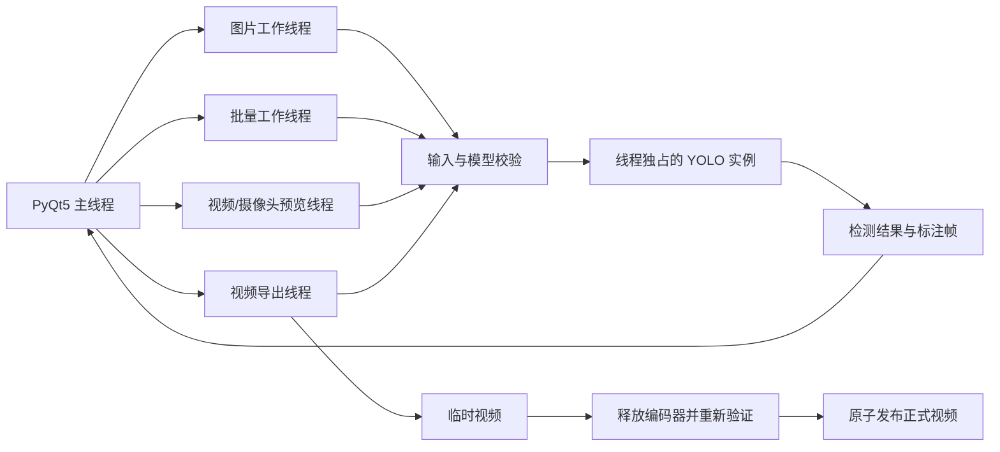

# 葡萄成熟度检测系统（Detection-System）

[English documentation](README.en.md)

Detection-System 是一个面向 Windows 的葡萄成熟度目标检测桌面应用。项目使用 Ultralytics YOLO 完成目标检测，以 PyQt5 提供图形界面，可处理单张图片、图片文件夹、视频文件和摄像头画面，并将检测到的葡萄分为“未成熟”“半成熟”“成熟”三类。

项目不仅提供基本演示界面，还对实际运行中的线程安全、模型信任、损坏媒体、输出覆盖、视频取消、CSV 公式注入和长时间运行内存增长进行了处理。它适合课程设计、计算机视觉原型、农业图像分析演示，以及经过独立验证和人工复核的辅助检测流程。

> 本项目不是食品安全、农业采收、品质认证或采购结算系统。默认模型的训练数据没有随仓库提供，检测结果不能作为高影响决策的唯一依据。

## 快速导航

- [功能概览](#功能概览)
- [快速开始](#快速开始)
- [图形界面使用指南](#图形界面使用指南)
- [命令行工具](#命令行工具)
- [配置项](#配置项)
- [更换默认模型](#更换默认模型)
- [架构与线程模型](#架构与线程模型)
- [开发、测试与质量检查](#开发测试与质量检查)
- [构建 Windows 可执行文件](#构建-windows-可执行文件)
- [常见问题](#常见问题)
- [已知限制](#已知限制)
- [许可证与合规状态](#许可证与合规状态)

## 功能概览

| 能力 | 当前实现 |
| --- | --- |
| 单张图片 | 检测、类别/置信度/坐标展示、阈值调整后防抖重检、标注图和 CSV 导出 |
| 图片文件夹 | 非递归批量检测、单文件失败隔离、结果缓存、批量标注图和汇总 CSV 导出 |
| 视频文件 | 后台逐帧预览、实时参数更新、可取消的完整视频导出 |
| 摄像头 | 指定设备编号、后台实时预览、再次点击关闭 |
| 模型保护 | 加载前核对 SHA-256，并验证类别编号和名称 |
| 媒体保护 | 扩展名、文件大小、图像尺寸、解码结果、视频元数据和时长检查 |
| 输出保护 | 默认写入用户数据目录、同名文件自动递增、视频临时文件验证后原子发布 |
| 运行稳定性 | 每个后台线程独占 YOLO 实例；取消导出会清除部分文件；表格最多保留 500 行 |
| 工程质量 | 18 项自动化测试、Ruff、pip-audit、Dependabot、Windows CI 和发布工作流 |

## 检测类别

默认模型的类别顺序固定如下。替换模型时必须保持相同编号和语义，否则程序会拒绝加载。

| 类别编号 | 模型名称 | 界面名称 |
| ---: | --- | --- |
| 0 | `immature` | 未成熟 |
| 1 | `semi-mature` | 半成熟 |
| 2 | `mature` | 成熟 |

## 运行环境

### 已验证环境

- 操作系统：Windows 10/11
- Python：CPython 3.10 和 3.12（由 GitHub Actions 持续验证）
- 推理：CPU 可直接使用；NVIDIA GPU 需要与驱动匹配的 PyTorch/CUDA 组合
- 桌面界面：PyQt5
- 模型运行时：PyTorch、TorchVision、Ultralytics
- 媒体处理：OpenCV、Pillow

运行依赖在 `requirements.txt` 中精确锁定。Python 3.10/3.11 使用 NumPy 2.2.6，Python 3.12 使用 NumPy 2.5.2。

如需 GPU 推理，请先阅读 [PyTorch Start Locally](https://pytorch.org/get-started/locally/) 并选择与操作系统、Python、显卡驱动和 CUDA 匹配的安装组合。项目锁定了经过测试的 PyTorch/TorchVision 版本；自行更换运行时后必须重新执行完整测试和模型自检。

## 快速开始

以下命令使用 PowerShell。

```powershell
git clone https://github.com/liuxiao20051106-prog/Detection-System.git
cd Detection-System

python -m venv .venv
.venv\Scripts\Activate.ps1

python -m pip install --upgrade pip
python -m pip install -r requirements.txt

python MainProgram.py
```

也可以运行：

```powershell
python installPackages.py
```

该脚本会使用当前 Python 解释器安装 `requirements.txt`。建议仍然先创建虚拟环境，以避免项目依赖污染系统 Python。

### 首次启动会检查什么

程序创建主窗口前会：

1. 创建或验证结果输出目录；
2. 检查默认模型文件是否存在；
3. 计算模型 SHA-256 并与配置值比较；
4. 后台任务实际加载模型时再次验证哈希和类别映射。

模型被修改、路径错误、哈希不匹配或类别顺序不一致时，程序会停止并显示错误，不会静默使用未知模型。

## 图形界面使用指南

### 1. 单张图片检测

1. 点击“图片”按钮并选择图片；
2. 等待后台任务完成模型加载和推理；
3. 在中央画面查看标注框；
4. 在结果列表中查看类别、置信度和坐标；
5. 选择某个目标可查看该目标的详细信息；
6. 点击“保存”导出标注图片和 CSV。

支持的图片扩展名：`.jpg`、`.jpeg`、`.png`、`.bmp`。

调整置信度、IoU 或标签显示后，单图模式会使用短暂防抖延迟重新检测，避免用户连续拖动参数时反复启动推理任务。

### 2. 图片文件夹批量检测

1. 点击“文件夹”按钮并选择目录；
2. 程序读取该目录第一层中的受支持图片，不递归进入子目录；
3. 每张图片独立校验和检测；
4. 损坏或不支持的单个文件会被跳过，不会中止整个批次；
5. 点击“保存”将缓存的标注图复制到结果目录，并生成一份汇总 CSV。

批量保存不会重新运行模型，因此保存结果与本次检测一致，也避免重复消耗时间。

### 3. 视频文件预览与导出

1. 点击“视频”按钮并选择文件；
2. 视频在后台线程中逐帧检测，界面保持响应；
3. 预览期间可修改置信度、IoU 和标签显示，后续帧会使用新参数；
4. 点击“保存”后，程序会提示视频导出不保留音频；
5. 确认后，程序停止预览并从头重新处理完整视频；
6. 导出窗口可随时取消。

支持的视频扩展名：`.avi`、`.mp4`、`.wmv`、`.mkv`、`.mov`、`.m4v`。

导出使用 XVID 编码和 AVI 容器。程序先写入隐藏的 `.partial.avi` 临时文件，释放编码器后重新打开文件检查帧数和分辨率，最后再原子替换为正式结果。取消、异常或验证失败都会删除部分文件。

### 4. 摄像头预览

1. 点击“摄像头”按钮打开 `DETECTION_CAMERA_ID` 指定的设备；
2. 再次点击同一按钮可安全停止预览；
3. 如果线程未能在等待时间内结束，界面会保留“正在运行”状态并提示稍后重试。

当前摄像头模式只提供实时预览，不支持直接保存视频。需要录制时，应先使用可信的录制工具生成视频文件，再通过视频模式检测和导出。

## 参数说明

| 参数 | 作用 | 调整影响 |
| --- | --- | --- |
| 置信度阈值（Confidence） | 过滤低置信度检测框 | 提高可减少误检，但可能漏检；降低可提高召回，但可能增加误检 |
| IoU 阈值 | 控制非极大值抑制中重叠框的保留程度 | 较低值更积极地合并重叠框，较高值可能保留更多相邻框 |
| 显示标签 | 控制标注图是否绘制类别和置信度文字 | 不影响模型检测结果，仅影响绘制内容 |

不同光照、葡萄品种、遮挡、拍摄距离和相机设备可能需要不同阈值。不要把某一组参数视为所有场景的通用最佳值。

## 输出文件

### 默认位置

Windows 默认输出目录：

```text
%LOCALAPPDATA%\Detection-System\results
```

可以通过 `DETECTION_SAVE_PATH` 修改。程序不会向仓库目录或安装目录写入运行结果。

### 命名规则

| 输入模式 | 典型输出 |
| --- | --- |
| 单图 | `grape_detect_result.png`、`grape_detections.csv` |
| 批量图片 | 每张图片的 `*_detect_result.<扩展名>`，以及 `<文件夹名>_detect_results.csv` |
| 视频 | `<原文件名>_detect_result.avi` |

若目标文件已经存在，程序会自动生成 `_2`、`_3` 等后缀，不覆盖已有结果。

CSV 使用 UTF-8 with BOM，便于 Windows 表格软件识别中文。文件字段、类别和坐标写入前会中和以 `=`、`+`、`-`、`@` 开头或在前导空白后出现这些符号的内容，降低电子表格公式注入风险。

## 命令行工具

桌面界面之外，仓库提供四个独立入口。

### 单张图片

```powershell
python imgTest.py "D:\images\grape.jpg"
python imgTest.py "D:\images\grape.jpg" --output "D:\results" --conf 0.35 --iou 0.50
```

| 参数 | 必填 | 默认值 | 说明 |
| --- | --- | --- | --- |
| `image` | 是 | — | 待检测图片路径 |
| `--output` | 否 | 配置的结果目录 | 标注图片输出目录 |
| `--conf` | 否 | `0.25` | 置信度阈值 |
| `--iou` | 否 | `0.45` | IoU 阈值 |

### 视频预览

```powershell
python VideoTest.py "D:\videos\grape.mp4"
```

按 `q` 结束。该脚本用于交互式预览，不写出结果视频。

### 摄像头预览

```powershell
python CameraTest.py --camera 0
```

按 `q` 结束。`--camera` 默认读取 `DETECTION_CAMERA_ID`。

### 模型训练

```powershell
python train.py --data "D:\dataset\data.yaml"
python train.py --data "D:\dataset\data.yaml" --model yolov8n.pt --epochs 120 --batch 16 --seed 0
```

| 参数 | 必填 | 默认值 | 说明 |
| --- | --- | --- | --- |
| `--data` | 是 | — | YOLO 数据集 YAML；文件必须存在且扩展名为 `.yaml` 或 `.yml` |
| `--model` | 否 | `yolov8n.pt` | 预训练模型名称或本地权重路径 |
| `--epochs` | 否 | `100` | 训练轮数 |
| `--batch` | 否 | `4` | 批大小 |
| `--seed` | 否 | `0` | 随机种子 |

训练入口启用确定性训练参数，但完整可复现仍取决于数据集、驱动、硬件、第三方库版本和底层算子。默认模型的训练数据不在本仓库中。

## 配置项

运行时配置集中在 `Config.py`，以下环境变量可覆盖默认值：

| 环境变量 | 默认值 | 说明 |
| --- | --- | --- |
| `DETECTION_MODEL_PATH` | `models/best.pt` | 默认推理模型的绝对或相对路径 |
| `DETECTION_MODEL_SHA256` | 仓库内置哈希 | 预期模型 SHA-256，必须是 64 位十六进制字符串 |
| `DETECTION_SAVE_PATH` | `%LOCALAPPDATA%\Detection-System\results` | 图片、CSV 和视频结果目录 |
| `DETECTION_CAMERA_ID` | `0` | OpenCV 摄像头设备编号 |

PowerShell 示例：

```powershell
$env:DETECTION_MODEL_PATH = "D:\models\best.pt"
$env:DETECTION_MODEL_SHA256 = "<64位 SHA-256>"
$env:DETECTION_SAVE_PATH = "D:\detection-results"
$env:DETECTION_CAMERA_ID = "1"

python MainProgram.py
```

环境变量只对当前 PowerShell 会话及其子进程生效，除非你将它们写入用户或系统环境配置。

## 更换默认模型

PyTorch `.pt` 权重不是普通静态数据，可能包含可执行的序列化对象。只使用来源明确、经过授权并由你信任的模型。

更换模型的推荐流程：

1. 将可信权重放到仓库外的受控目录，或在确认分发权后替换 `models/best.pt`；
2. 计算 SHA-256：

   ```powershell
   Get-FileHash -Algorithm SHA256 "D:\models\best.pt"
   ```

3. 设置 `DETECTION_MODEL_PATH` 和 `DETECTION_MODEL_SHA256`；
4. 确认模型类别严格为 `{0: immature, 1: semi-mature, 2: mature}`；
5. 执行源码自检和完整测试；
6. 如果要修改仓库默认模型，同时更新 `Config.py`、`MODEL_CARD.md`、测试和授权记录。

源码自检：

```powershell
python MainProgram.py --self-test
Get-Content "$env:TEMP\Detection-System-self-test.log"
```

自检会校验模型哈希和类别，并对一张空白图执行真实推理。成功时日志内容为 `OK`。

## 输入与安全边界

### 图片限制

- 最大文件大小：100 MiB；
- 最大像素数：80,000,000；
- OpenCV 完整解码前先使用 Pillow 读取尺寸信息；
- 扩展名正确但内容损坏的文件会被拒绝。

### 视频限制

- 最大文件大小：20 GiB；
- 单帧最大像素数：80,000,000；
- 元数据可用时，最长允许 4 小时；
- 帧率无效时，预览和导出按 25 FPS 的回退值处理。

这些检查降低了意外资源消耗和常见损坏文件风险，但不能让第三方解码器变成完全可信的安全边界。处理来源不明的媒体时，建议使用权限受限账户、隔离环境和最新系统安全更新。

更多报告方式和信任边界见 [SECURITY.md](SECURITY.md)。

## 架构与线程模型



核心原则：

- Qt 主线程只处理界面事件和结果展示，不执行 YOLO 推理；
- 每个任务在线程内部创建自己的 YOLO 实例，不跨线程共享模型；
- 停止操作使用协作式事件，不强制终止线程；
- 窗口关闭前会请求所有任务停止并等待确认；
- 每个后台任务加载模型前重新验证模型哈希和类别；
- 批量任务缓存已检测的标注图，保存阶段不重复推理；
- 视频只有在编码器释放并通过重新打开检查后才报告成功。

这种设计用额外的模型加载时间和短时内存占用换取更明确的线程所有权和可验证的取消行为。完整决策记录见 [ADR-0001](docs/decisions/0001-background-workers-and-trusted-models.md)，线程安全背景可参考 Ultralytics 的 [Thread-Safe Inference 指南](https://docs.ultralytics.com/guides/yolo-thread-safe-inference/)。

## 项目结构

```text
Detection-System/
├─ MainProgram.py                 图形界面、交互状态和任务调度
├─ Config.py                      模型、哈希、输出目录和类别配置
├─ detection_core.py              输入校验、结果数据结构和安全导出
├─ workers.py                     图片、批量、预览和导出后台线程
├─ detect_tools.py                OpenCV/Pillow/Qt 图像辅助函数
├─ imgTest.py                     单图命令行入口
├─ VideoTest.py                   视频预览命令行入口
├─ CameraTest.py                  摄像头预览命令行入口
├─ train.py                       可配置的 YOLO 训练入口
├─ DetectionSystem.spec           Windows PyInstaller 构建配置
├─ hooks/                         Torch/PyQt 打包钩子
├─ UIProgram/                     Qt 界面、样式和内嵌资源
├─ models/
│  ├─ best.pt                     默认推理权重
│  └─ imported_train_result_*/    保留的训练指标与图表
├─ TestFiles/                     手工演示图片，不是基准测试集
├─ tests/                         核心、线程、GUI 和导出回归测试
├─ docs/decisions/                架构决策记录
├─ .github/workflows/             CI 和 Windows 发布工作流
├─ requirements.txt               精确锁定的运行依赖
├─ requirements-dev.txt           测试、静态检查和漏洞审计依赖
└─ requirements-build.txt         Windows 打包依赖
```

## 模型信息

默认模型文件为 `models/best.pt`，SHA-256：

```text
ada66cb1215507aa4652d60b073ef64f9c6465daeac7e96475abe151b3d120c0
```

仓库保留的训练日志记录的最佳验证轮次为 85：

| 指标 | 值 |
| --- | ---: |
| Precision | 0.64801 |
| Recall | 0.59576 |
| mAP@0.5 | 0.61437 |
| mAP@0.5:0.95 | 0.45016 |

这些指标来自仓库中的训练日志，不代表所有环境中的实际效果。由于缺少训练数据、标注规则、数据授权和数据划分，无法只依靠本仓库独立复现或审计这些指标。详细限制见 [MODEL_CARD.md](MODEL_CARD.md)。

## 开发、测试与质量检查

安装开发依赖：

```powershell
python -m venv .venv
.venv\Scripts\Activate.ps1
python -m pip install --upgrade pip
python -m pip install -r requirements-dev.txt
```

运行提交前检查：

```powershell
$env:QT_QPA_PLATFORM = "offscreen"
$env:PYTHONDONTWRITEBYTECODE = "1"

python -m ruff check .
python -m unittest discover -s tests -v
python -m pip_audit -r requirements.txt --strict
```

当前测试覆盖：

- 配置、类别映射和资源存在性；
- 中文路径图片读写；
- 损坏图片、视频元数据和模型哈希校验；
- 输出不覆盖和 CSV 公式注入防护；
- Qt 资源、窗口缩放、表格上限和进度取消；
- 摄像头线程无法停止时的状态保持；
- 视频取消后部分文件清理；
- 视频完成信号只在文件可重新读取后发出。

GitHub Actions 在 Windows 上使用 Python 3.10 和 3.12 运行 Ruff 与全部测试，并在 Python 3.12 任务中执行完整依赖漏洞审计。

## 构建 Windows 可执行文件

```powershell
python -m pip install -r requirements-build.txt
python -m PyInstaller --noconfirm --clean DetectionSystem.spec
```

产物：

```text
dist\Detection-System.exe
```

构建完成后必须执行：

```powershell
$process = Start-Process `
  -FilePath "dist\Detection-System.exe" `
  -ArgumentList "--self-test" `
  -WindowStyle Hidden `
  -Wait `
  -PassThru

$process.ExitCode
Get-Content "$env:TEMP\Detection-System-self-test.log"
```

只有退出码为 `0` 且日志为 `OK`，才能认为打包程序实际完成了模型加载和推理。仅看到 PyInstaller “Build complete” 不足以证明程序可运行。构建机制说明见 [PyInstaller 官方手册](https://pyinstaller.org/en/stable/)。

发布工作流支持两种触发方式：

- 在 GitHub Actions 中手动运行 `Build Windows release`；
- 推送 `v*` 标签，工作流测试、构建、自检、上传产物并创建 GitHub Release。

## 常见问题

### 启动时提示模型完整性校验失败

模型内容与 `DETECTION_MODEL_SHA256` 不一致。不要直接关闭校验。确认模型来源，重新计算哈希，并同步更新路径和哈希配置。

### 模型类别与配置不一致

模型的 `names` 不是三类固定映射，或编号顺序不同。请使用兼容模型，或在明确改变产品语义后同步修改配置、界面、模型卡和测试。

### 摄像头无法打开

- 确认摄像头没有被其他程序独占；
- 检查 Windows 相机隐私权限；
- 尝试 `DETECTION_CAMERA_ID=1` 或更高编号；
- 使用 `python CameraTest.py --camera <编号>` 单独排查。

### 视频无法打开或导出

OpenCV 构建可能不支持该文件的编码器。可先转换为常见 MP4/H.264 输入；正式导出仍使用 XVID/AVI。确认输出目录可写，并留出足够磁盘空间。

### 界面显示但没有检测框

- 降低置信度阈值；
- 检查目标是否属于三个训练类别；
- 确认图像清晰度、光照和拍摄距离；
- 使用模型训练分布以外的数据时，先建立独立标注集评估泛化能力。

### PowerShell 不允许激活虚拟环境

可在当前终端临时允许脚本：

```powershell
Set-ExecutionPolicy -Scope Process -ExecutionPolicy Bypass
.venv\Scripts\Activate.ps1
```

也可以不激活，直接使用 `.venv\Scripts\python.exe` 执行命令。

### NVIDIA GPU 没有被使用

运行以下命令检查：

```powershell
python -c "import torch; print(torch.__version__); print(torch.cuda.is_available())"
```

若返回 `False`，请核对显卡驱动以及 PyTorch 官方安装选择器给出的 CUDA 版本，不要混用不兼容的 Torch 和 TorchVision。

## 已知限制

- 仅对 Windows 桌面环境和项目锁定的 Python 版本进行持续验证；
- 摄像头模式不直接录制或保存；
- 导出视频不保留原始音频；
- 批量图片模式不递归扫描子目录；
- 表格最多保留最近 500 行，避免长时间运行时无限增长；
- 每个任务重新加载模型，启动存在延迟，并可能短时增加内存占用；
- 默认模型的训练数据、标注、数据来源和授权文件未包含在仓库中；
- 示例图片只是演示素材，不是带标签的基准测试集；
- 模型指标不能代表不同品种、产地、季节、设备、遮挡和光照环境；
- 当前项目没有所有者声明的项目级许可证。

## 文档导航

- [MODEL_CARD.md](MODEL_CARD.md)：模型指标、适用范围和数据限制
- [SECURITY.md](SECURITY.md)：漏洞报告方式、模型和媒体信任边界
- [THIRD_PARTY_NOTICES.md](THIRD_PARTY_NOTICES.md)：第三方组件与授权注意事项
- [CONTRIBUTING.md](CONTRIBUTING.md)：开发、测试和提交要求
- [CHANGELOG.md](CHANGELOG.md)：版本变更记录
- [ADR-0001](docs/decisions/0001-background-workers-and-trusted-models.md)：后台线程与可信模型决策
- [Ultralytics Quickstart](https://docs.ultralytics.com/quickstart/)：Ultralytics 官方安装和使用说明

## 贡献

提交功能或修复时：

1. 保持 PyQt5 桌面应用和三类成熟度语义；
2. 不在 Qt 主线程执行推理，不跨线程共享 YOLO 实例；
3. 不绕过模型哈希、类别映射或媒体校验；
4. 为行为变化增加回归测试；
5. 运行 Ruff、完整测试和适用的依赖审计；
6. 不提交运行结果、IDE 配置、缓存、未授权数据或来源不明的权重；
7. 涉及默认模型时同步更新哈希、模型卡和授权记录。

完整要求见 [CONTRIBUTING.md](CONTRIBUTING.md)。

## 许可证与合规状态

当前仓库没有项目所有者声明的 `LICENSE` 文件。在许可证明确之前，不要假定项目代码、模型或素材可以自由复制、修改、再发布或商用。

PyQt5、Ultralytics、OpenCV、视频编解码器、模型权重和训练数据分别具有自己的授权条件。分发 EXE、提供网络服务或用于商业场景前，必须逐项完成许可证和数据来源审查。本仓库中的 [THIRD_PARTY_NOTICES.md](THIRD_PARTY_NOTICES.md) 仅提供边界提示，不构成法律意见。
